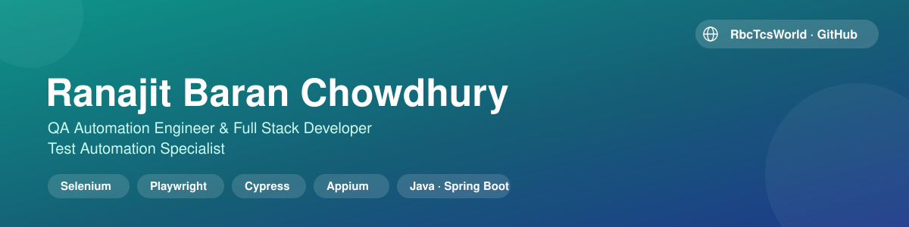

[-2dd4bf?style=for-the-badge&logo=apple&logoColor=white)](https://rbchy.github.io/rbchy/download.html)

---

## 📍 Contact Information

| Field | Details |
|-------|---------|
| **Location** | West Norriton, Pennsylvania 19403, USA |
| **Email** | chyranajit@gmail.com |
| **Phone** | +1 (267) 342-5565 |
| **Portfolio** | [rbc6543.wixsite.com/rbc-portfolio](https://rbc6543.wixsite.com/rbc-portfolio) |
| **LinkedIn** | [linkedin.com/in/rbchy](https://www.linkedin.com/in/rbchy/) |
| **GitHub** | [@rbchy](https://github.com/rbchy) |
| **Availability** | Full-time · Contract · Freelance · Remote |

---

## 🙋 Professional Summary

I am a **QA Automation Engineer** with deep expertise in building enterprise-level test automation frameworks and a strong background in software programming, system design, and scalable architecture. With **decades of experience** spanning from container terminal management systems to modern web application automation, I bring a unique blend of analytical thinking, systems design expertise, and hands-on technical skills.

### Core Expertise

- 🎯 **BDD Automation Frameworks** — Building production-grade frameworks using Cucumber, Behave, and Gherkin
- 🔄 **Cross-Browser Testing** — Playwright and Selenium WebDriver with modern async patterns
- 🌐 **API Automation** — REST endpoint testing with Postman and Rest Assured
- ⚙️ **CI/CD Integration** — Jenkins, GitHub Actions, and cloud-based test execution
- 📊 **Enterprise Systems** — 40+ years of experience with container management, billing, and inventory systems
- 💾 **Full Stack Development** — Java, Python, TypeScript, MySQL, DataFlex RDBMS, Oracle and modern web technologies

**Philosophy:** *"Quality is never an accident; it is always the result of intelligent effort."*

---

## 💾 Download

[-2dd4bf?style=for-the-badge&logo=apple&logoColor=white)](https://rbchy.github.io/rbchy/download.html)

Desktop app version of my portfolio, packaged with Electron — runs fully offline, no browser required. Click the button above to see the release page with the `.dmg` file, version notes, and file size before downloading.

---

## 🚀 Current Focus Areas

- ✅ Building **enterprise-level BDD automation frameworks** from scratch
- ✅ **Playwright** with TypeScript & Python for modern browser automation
- ✅ **API Automation** covering REST endpoint validation and data-driven testing
- ✅ **CI/CD Pipeline Integration** — Jenkins, GitHub Actions, cloud execution
- ✅ **Cloud-based Testing** — Sauce Labs, AWS cloud infrastructure
- ✅ **AI-Assisted QA Automation** — Intelligent test generation and analysis
- ✅ **Full Stack Development** — Java, Python backend with MySQL/PostgreSQL databases
- ✅ **System Design** — Building scalable, maintainable automation solutions

---

## 🛠️ Technical Skills Matrix

### Programming Languages

| Language | Proficiency | Experience | Projects |
|----------|------------|-----------|----------|
| Java | Expert | 10+ years | Automation Frameworks, Desktop Apps, API Testing |
| Python | Advanced | 5+ years | BDD Frameworks, Playwright Automation, Data Analysis |
| TypeScript | Advanced | 4+ years | Playwright, Cucumber, Node.js Applications |
| JavaScript | Intermediate | 3+ years | Automation Scripts, Web Automation |
| SQL | Advanced | 5+ years | Database Design, Query Optimization |
| Bash/Shell | Intermediate | 8+ years | CI/CD Scripts, System Automation |

### UI Automation & Testing Frameworks

| Framework | Language | Expertise | Use Case |
|-----------|----------|-----------|----------|
| Playwright | TypeScript, Python, Java | Expert | Modern, fast, reliable browser automation |
| Selenium WebDriver | Java, Python | Expert | Legacy and modern web applications |
| Cucumber | Java, Cucumber-JS | Expert | BDD feature files and test execution |
| Behave | Python | Advanced | Python-based BDD automation |
| TestNG | Java | Expert | Test execution, reporting, data-driven testing |
| JUnit | Java | Advanced | Unit testing and integration testing |
| Cypress | JavaScript, TypeScript | Intermediate | E2E testing for web applications |

### API Testing & REST Automation

| Tool | Expertise | Use Cases |
|------|-----------|----------|
| Postman | Expert | API design, testing, collections, CI/CD integration |
| Rest Assured | Expert | REST API automation with Java TestNG |
| Swagger/OpenAPI | Advanced | API specification and contract testing |
| Insomnia | Intermediate | REST API testing and debugging |
| GraphQL | Intermediate | GraphQL endpoint testing |

### Build Tools & CI/CD

| Tool | Proficiency | Experience |
|------|------------|-----------|
| Maven | Expert | Project automation, dependency management, plugins |
| Gradle | Advanced | Build automation, task execution |
| npm | Advanced | Node.js package management for Playwright, Cucumber |
| Jenkins | Expert | Pipeline configuration, job scheduling, integration |
| GitHub Actions | Advanced | Workflow automation, PR checks, scheduled tests |
| Docker | Intermediate | Containerized test execution |
| AWS EC2/S3 | Intermediate | Cloud-based test infrastructure |

### Cloud & Reporting Platforms

| Platform | Expertise | Features Used |
|----------|-----------|----------------|
| Sauce Labs | Expert | Cross-browser testing, 700+ browser/OS combinations, video recording |
| AWS | Advanced | EC2 instances, S3 storage, CloudWatch monitoring |
| Allure Reports | Expert | Beautiful, detailed test reporting with trends |
| Cucumber HTML Reports | Advanced | BDD test result visualization |
| TestNG Reports | Advanced | Detailed test execution metrics |
| Jira Integration | Expert | Defect tracking, test result linking |

### Version Control & Tools

| Tool | Proficiency | Experience |
|------|------------|-----------|
| Git | Expert | Branching, merging, rebasing, conflict resolution |
| GitHub | Expert | Repository management, pull requests, workflow automation |
| GitLab | Advanced | CI/CD pipelines, repository management |
| Bitbucket | Intermediate | Team collaboration and code reviews |
| Visual Studio Code | Expert | Primary IDE for automation development |
| IntelliJ IDEA | Expert | Java development and debugging |
| Eclipse | Advanced | Java and Selenium automation development |
| Jira | Expert | Agile project management, sprint planning, defect tracking |
| Confluence | Advanced | Documentation and team collaboration |

### Database Technologies

| Database | Proficiency | Experience |
|----------|------------|-----------|
| MySQL | Expert | Database design, optimization, JDBC connectivity |
| DataFlex | Advanced | Enterprise database systems |
| Oracle | Advanced | Enterprise database systems |
| PostgreSQL | Advanced | Complex queries, transaction management |
| MongoDB | Intermediate | NoSQL document databases |
| Firebase | Intermediate | Real-time database testing |

### Operating Systems & Environments

| Platform | Proficiency |
|----------|------------|
| Windows | Expert |
| macOS | Advanced |
| Linux/Ubuntu | Advanced |
| Docker Containers | Intermediate |
| Cloud (AWS) | Intermediate |

---

## 📂 Featured Automation Projects

### 🔬 QA Brains Automation — Python + Playwright + Behave

Enterprise BDD test automation framework demonstrating modern Python automation patterns.

**Stack:** Python 3.9+ · Playwright · Behave · Allure Reports · Page Object Model
**Highlights:** 12 PASSED tests consistently · 3 SKIPPED (documented known site bugs) · 0 FAILED in production runs · modular POM structure · screenshot on failure · retry logic
**Repository:** [QaBrainsAutomationPythonPlawright](https://github.com/rbchy/QaBrainsAutomationPythonPlawright)

---

### 🔬 QA Brains Automation — TypeScript + Playwright + Cucumber

Enterprise-grade BDD framework built with TypeScript for modern JavaScript ecosystems.

**Stack:** TypeScript 5.x · Playwright (async/await) · Cucumber.js · Node.js · Cucumber HTML Reporter
**Highlights:** 14 PASSED · 1 PENDING (known site bug) · 0 FAILED · full async/await implementation · CI/CD-ready with GitHub Actions
**Repository:** [QaBrainsAutomationTypeScriptPlaywright](https://github.com/rbchy/QaBrainsAutomationTypeScriptPlaywright)

---

### 🔬 QA Brains Automation — Java + Playwright + Cucumber

Original enterprise BDD framework demonstrating Playwright for Java with Cucumber JVM.

**Stack:** Java 17+ · Playwright for Java · Cucumber JVM · TestNG · Maven · POM
**Highlights:** comprehensive Gherkin feature files · multi-threading via TestNG · data-driven scenarios · detailed TestNG + Allure reports
**Repository:** [QaBrainsAutomationJavaPlaywright](https://github.com/rbchy/QaBrainsAutomationJavaPlaywright)

---

### 🔬 OpenEMR Healthcare Automation — Selenium + Java + Cucumber

Healthcare application UI automation framework for OpenEMR (Electronic Medical Records system).

**Stack:** Java · Selenium WebDriver · Cucumber · TestNG · Maven · Jira
**Scope covered:** patient management, authentication, navigation, form validation, medical records access, role-based access control, appointment scheduling
**Live site:** [demo.openemr.io](https://demo.openemr.io) · **Repository:** [OpenEMR_Automation](https://github.com/rbchy/OpenEMR_Automation)

---

### ☁️ Sauce Labs Cloud Automation — Selenium + Java + Cucumber

Cross-browser cloud automation framework integrated with Sauce Labs for enterprise testing.

**Stack:** Java · Selenium WebDriver · Cucumber · TestNG · Sauce Labs (700+ browser/OS combinations) · Maven · Jenkins
**Coverage:** Chrome, Firefox, Safari, Edge across Windows/macOS/Linux; desktop & mobile viewports; video recording on failure; Jenkins pipeline with 20+ parallel browser/OS combinations
**Repository:** [QaBrainsSauceLabAPI_Automation](https://github.com/rbchy/QaBrainsSauceLabAPI_Automation) <!-- TODO: confirm this is the right repo for this project -->

---

### 🌐 API Testing Framework — Postman + Rest Assured

Comprehensive API test automation covering REST endpoint validation and contract testing.

**Stack:** Postman Collections · Rest Assured (Java) · TestNG · Maven · JSON/XML · OAuth 2.0
**Coverage:** positive/negative cases, auth flow validation, data-driven datasets, response time and header verification, environment-based config (Dev/Staging/Prod)
**Repositories:** [QaBrainsAPIAutomationRestAssured](https://github.com/rbchy/QaBrainsAPIAutomationRestAssured) · [QaBrainsAPIAutomation_Postman](https://github.com/rbchy/QaBrainsAPIAutomation_Postman)

---

### 💼 Payroll Management System — Java + MySQL + JDBC

Full-featured desktop payroll application with enterprise database connectivity.

**Stack:** Java (Swing/AWT) · MySQL 8.0+ · JDBC · DAO pattern · Maven
**Features:** employee CRUD, attendance tracking, automated salary calculation (HRA/DA/PF/Gross/Net), pay slip generation, secure authentication, layered UI → Service → DAO → Database architecture
**Repository:** [PayrollManagementSystem](https://github.com/rbchy/PayrollManagementSystem)

---

### 🏭 Pharmaceutical Packaging Inventory Management System — Java + MySQL

Enterprise-grade real-time inventory management system for pharmaceutical supply chain.

**Stack:** Java 17+ · MySQL 8.0+ · JDBC + MySQL Connector/J 9.7.0 · DAO + Service + MVC
**Modules:** material inventory CRUD, supplier management with performance ratings, real-time stock dashboard, transaction logging/audit trail, purchase order system, low-stock alerts
**Repository:** [PPES-Pharmaceutical-Packaging-Management](https://github.com/rbchy/PPES-Pharmaceutical-Packaging-Management)

---

## 📦 All Repositories (32)

Full list of my public repositories on GitHub, sorted alphabetically. The frameworks highlighted above under [Featured Automation Projects](#-featured-automation-projects) are the ones with the deepest write-ups — everything else I've built is listed here.

<strong>Click to expand the full list of 32 repositories</strong>

| # | Repository | Description | Language |
|---|-----------|-------------|----------|
| 1 | [Amazon-Cypress-JavaScript-Automation](https://github.com/rbchy/Amazon-Cypress-JavaScript-Automation) | Production-grade E2E test automation framework for Amazon.com using BDD principles, built with Cypress 14 + Cucumber | — |
| 2 | [AmazonSeleniumTest](https://github.com/rbchy/AmazonSeleniumTest) | Selenium test for Amazon | Java |
| 3 | [AndroidUIAppiumTest_MyDemoEcommerce](https://github.com/rbchy/AndroidUIAppiumTest_MyDemoEcommerce) | Android UI automation framework built with Appium 3, UiAutomator2, TestNG, and Java 17 | HTML |
| 4 | [AppiumAutomation_ApiDemos](https://github.com/rbchy/AppiumAutomation_ApiDemos) | ApiDemos automation built with Appium 3.5.2, TestNG, Maven, and ExtentReports (Page Object Model) | HTML |
| 5 | [AppiumMobileAutomation](https://github.com/rbchy/AppiumMobileAutomation) | End-to-end Android automation with Appium, TestNG & Allure Reports — 100% pass rate on Sauce Labs My Demo App | Java |
| 6 | [AppiumTest_Andriod_Automation](https://github.com/rbchy/AppiumTest_Andriod_Automation) | Java-based mobile test automation framework built with Appium, TestNG, Cucumber (BDD), and Page Object Model | HTML |
| 7 | [BhojanAloy-Food-Coffee-Shop-POS-System](https://github.com/rbchy/BhojanAloy-Food-Coffee-Shop-POS-System) | Java Swing + MySQL point-of-sale system for a food & coffee shop — end-to-end order taking, itemized bill preview | JavaScript |
| 8 | [Guru99TelTest](https://github.com/rbchy/Guru99TelTest) | Selenium/Java test project against the Guru99 demo site | Java |
| 9 | [InventoryControlManagement_JavaMySql](https://github.com/rbchy/InventoryControlManagement_JavaMySql) | Real-time inventory management system built with Java 17, MySQL 8.0, and JDBC | — |
| 10 | [Multicart_Demo_Automation](https://github.com/rbchy/Multicart_Demo_Automation) | E-commerce multi-cart functionality automation — Java, Selenium WebDriver, and Cucumber | HTML |
| 11 | [NorthFace_AutomationExercise-BDD-Test-Automation](https://github.com/rbchy/NorthFace_AutomationExercise-BDD-Test-Automation) | Multi-layer automation framework covering UI, E2E, API, Unit, Accessibility, Performance, and Security testing in one project | Java |
| 12 | [OpenEMR_Automation](https://github.com/rbchy/OpenEMR_Automation) | Health record and medical practice management solution automation | HTML |
| 13 | [OrangeHRM_Automation](https://github.com/rbchy/OrangeHRM_Automation) | Automation for OrangeHRM, an all-in-one HR software platform | HTML |
| 14 | [OrangeHRM_TestAutomation_TestNG_Junit5](https://github.com/rbchy/OrangeHRM_TestAutomation_TestNG_Junit5) | AI-enhanced QA framework for an HRM/Payroll system, built around the public OrangeHRM demo plus a locally-stubbed payroll/tax/insurance backend | Java |
| 15 | [ParaBank-BankingAutomationJavaSelenium](https://github.com/rbchy/ParaBank-BankingAutomationJavaSelenium) | Banking automation using Java, JavaScript, MySQL, Spring Boot & Selenium | HTML |
| 16 | [PayrollManagementSystem](https://github.com/rbchy/PayrollManagementSystem) | Payroll management system using Java & MySQL | Java |
| 17 | [PayrollManagementSystems_Automation_Java_MySql_Selenium](https://github.com/rbchy/PayrollManagementSystems_Automation_Java_MySql_Selenium) | Desktop payroll application built with Java Swing and MySQL, packaged and tested with Maven | Java |
| 18 | [PPES-Pharmaceutical-Packaging-Management](https://github.com/rbchy/PPES-Pharmaceutical-Packaging-Management) | Pharmaceutical packaging management system using MySQL, Java | Java |
| 19 | [QaBrainsAPIAutomationRestAssured](https://github.com/rbchy/QaBrainsAPIAutomationRestAssured) | QaBrains API automation using Rest Assured | HTML |
| 20 | [QaBrainsAPIAutomation_Postman](https://github.com/rbchy/QaBrainsAPIAutomation_Postman) | QaBrains API automation using Postman & Newman | — |
| 21 | [QaBrainsAutomationCypressJavaScript](https://github.com/rbchy/QaBrainsAutomationCypressJavaScript) | Production-grade E2E test automation framework for the QaBrains e-commerce application | HTML |
| 22 | [QaBrainsAutomationJavaPlaywright](https://github.com/rbchy/QaBrainsAutomationJavaPlaywright) | QaBrains automation using Java & Playwright browser automation | HTML |
| 23 | [QaBrainsAutomationJavaSelenium](https://github.com/rbchy/QaBrainsAutomationJavaSelenium) | Selenium WebDriver + Java + Cucumber BDD + TestNG + Maven | HTML |
| 24 | [QaBrainsAutomationPythonPlawright](https://github.com/rbchy/QaBrainsAutomationPythonPlawright) | QaBrains automation using Python and Playwright with the Behave BDD framework | Python |
| 25 | [QaBrainsAutomationTypeScriptPlaywright](https://github.com/rbchy/QaBrainsAutomationTypeScriptPlaywright) | QaBrains automation using TypeScript and Playwright browser automation | HTML |
| 26 | [QaBrainsSauceLabAPI_Automation](https://github.com/rbchy/QaBrainsSauceLabAPI_Automation) | AI-driven quality automation testing platform using Java, Selenium & BDD Cucumber | HTML |
| 27 | [ranajitchowdhury](https://github.com/rbchy/ranajitchowdhury) | Portfolio repo — 20+ projects across Mobile, E-Commerce, Banking, Healthcare, HR Systems, and API Testing | — |
| 28 | [rbchy](https://github.com/rbchy/rbchy) | This profile README repository | HTML |
| 29 | [RbcTcsWorld-EPMS](https://github.com/rbchy/RbcTcsWorld-EPMS) | Full-stack payroll management system with Spring Boot REST API and a comprehensive test suite | PowerShell |
| 30 | [RbcTcsWorld_ClinTrial-Connect](https://github.com/rbchy/RbcTcsWorld_ClinTrial-Connect) | Spring Boot clinical-trial patient-matching application with 115+ automated tests | Java |
| 31 | [Sauce-Demo.MyShopify.AutomationTest](https://github.com/rbchy/Sauce-Demo.MyShopify.AutomationTest) | E-commerce site automation test using Java and Selenium | HTML |
| 32 | [WebdriverIO-Native-DemoApp-MobileTestAutomationJavaAppiumTestNG](https://github.com/rbchy/WebdriverIO-Native-DemoApp-MobileTestAutomationJavaAppiumTestNG) | Mobile test automation framework for the Android WDIO Native Demo App — Appium 9.2.2 (java-client), TestNG, Maven, Allure Report, ExtentReports | Java |

*(Language column shows GitHub's detected primary language for each repo; "—" means GitHub hasn't detected one, usually for very small or config-only repos.)*

---

## 📊 Testing Methodologies & Practices

| Practice | Details | Tools |
|----------|---------|-------|
| **Agile Scrum** | Sprint planning, standups, retros, velocity tracking | Jira, Confluence |
| **BDD** | Gherkin, Given/When/Then, living documentation | Cucumber, Behave |
| **SDLC/STLC** | Full lifecycle from requirements to production | Jira, TestNG, Maven |
| **Page Object Model** | Element abstraction, maintainable scripts | Selenium, Playwright |
| **CI/CD Integration** | Automated build/test, quality gates, deployment | Jenkins, GitHub Actions, Maven |
| **API Testing** | Contract testing, data-driven scenarios, auth testing | Postman, Rest Assured |
| **Defect Management** | Triage, severity assessment, root cause analysis | Jira |
| **Cloud-Based Testing** | Cross-browser/device testing, real-time dashboards | Sauce Labs, AWS |

---

## 💻 Platform & Environment Expertise

| Category | Platforms |
|----------|-----------|
| **Operating Systems** | Windows, macOS, Linux/Ubuntu, Docker |
| **Cloud Platforms** | AWS (EC2, S3, CloudWatch), Sauce Labs, GitHub Pages |
| **IDE & Editors** | IntelliJ IDEA, Eclipse, Visual Studio Code, NetBeans |
| **Browsers** | Chrome, Firefox, Safari, Edge, mobile browsers |
| **Test Management** | Jira, TestRail, Confluence |
| **Version Control** | GitHub, GitLab, Bitbucket |
| **Build Systems** | Maven, Gradle, npm, Docker |
| **CI/CD Platforms** | Jenkins, GitHub Actions, GitLab CI |

---

## 👨‍💼 Professional Background

**40+ years of technology experience**

**2016–Present — Self-Employed / RbcTcsWorld**
System Designer, Web Developer, Full Stack Developer & QA Automation Specialist. Focus: enterprise BDD automation frameworks (Playwright, Selenium, Cucumber), API test automation (Rest Assured, Postman), full stack applications (Java, Python, JavaScript), inventory and payroll systems, healthcare application automation.

**1990–1995 — The Computer Systems (Bangladesh)**
System Consultant, Designer & Programmer. Delivered custom desktop systems for sales management, inventory control, billing, personnel management, personnel banking, and payroll.

**1979–2016 — Chittagong Port Authority (Bangladesh)**
Traffic Inspector, Super User & System Consultant for the NAVIS SPARCS N4 Container Terminal Management System. Managed billing for 10,000+ container transactions/day, cut billing errors by 95% through process optimization, trained 50+ users, maintained 99.8% system uptime.

---

## 🎓 Education

| Degree | Field | Institution | Year |
|--------|-------|-----------|------|
| Master's Degree | Public Administration | University of Chittagong, Bangladesh | 1984–1985 |
| Continuous Learning | QA Automation, BDD, Modern Web Technologies | Online Certifications & Self-Study | 2020–Present |

**Certifications & training:** Selenium WebDriver Automation · Cucumber BDD Framework · Playwright Browser Automation · API Testing with Rest Assured · Maven Build Automation · Jenkins CI/CD Pipeline Configuration · Cloud Testing on Sauce Labs · Java Full Stack Development

---

## 🌟 Why Hire Me?

- **Decades of systems experience** — deep understanding of complex enterprise systems, process optimization, and system design, from container terminal management to modern web applications
- **Modern automation expertise** — proficient in Playwright, Selenium, Cucumber, and Behave with production-grade BDD frameworks
- **Full stack capabilities** — beyond QA automation: backend services, APIs, and database systems for end-to-end solutions
- **Cloud-ready** — Sauce Labs cross-browser testing, AWS infrastructure, CI/CD pipeline integration
- **Remote-ready** — disciplined, self-motivated, strong communicator, proven ability to work independently and collaboratively
- **Continuous learner** — always updating skills: TypeScript, modern Python patterns, AI-assisted QA

---

## 🎯 Open Opportunities

Actively seeking full-time QA automation engineer roles, contract/project-based automation work, freelance QA consulting, and full stack development (Java/Python backends with MySQL). Preference for remote-first positions, flexible time zones, and long-term partnerships on challenging technical projects.

---
<picture>
  <source media="(prefers-color-scheme: dark)" srcset="https://raw.githubusercontent.com/<আপনার-username>/<repo-নাম>/output/github-contribution-grid-snake-dark.svg" />
  <source media="(prefers-color-scheme: light)" srcset="https://raw.githubusercontent.com/<আপনার-username>/<repo-নাম>/output/github-contribution-grid-snake.svg" />
  /<repo-নাম>/output/github-contribution-grid-snake.svg" />
</picture>

## 📊 GitHub Stats

---

## 📞 Let's Connect!

| Channel | Details |
|---------|---------|
| 📧 Email | chyranajit@gmail.com |
| 📞 Phone | +1 (267) 342-5565 |
| 💼 LinkedIn | [linkedin.com/in/rbchy](https://www.linkedin.com/in/rbchy/) |
| 🐙 GitHub | [@rbchy](https://github.com/rbchy) |
| 🌐 Portfolio | [rbc6543.wixsite.com/rbc-portfolio](https://rbc6543.wixsite.com/rbc-portfolio) |
| 💾 Desktop App | [Download for macOS (.dmg)](https://rbchy.github.io/rbchy/download.html) |

**Version:** 2.3 · **Last Updated:** September 2026 · **Status:** Actively Open to New Opportunities

*"Quality is never an accident; it is always the result of intelligent effort."*

