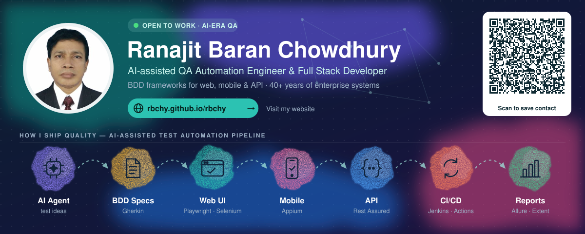
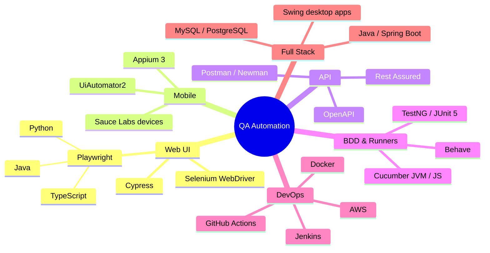
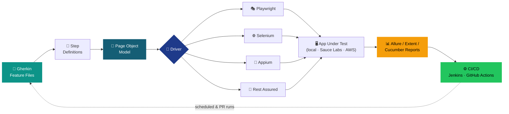
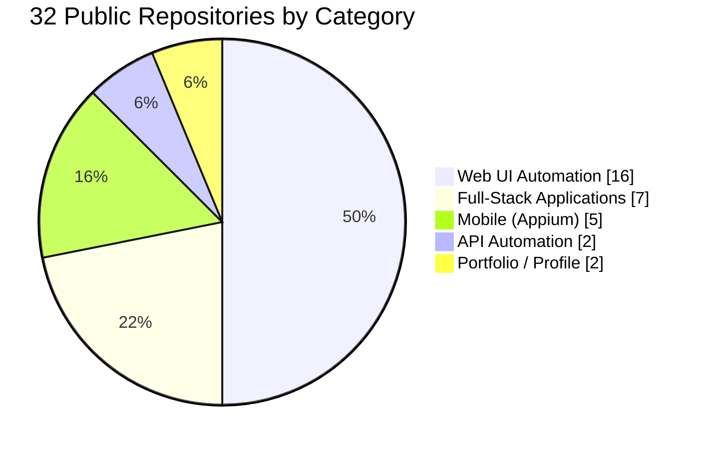
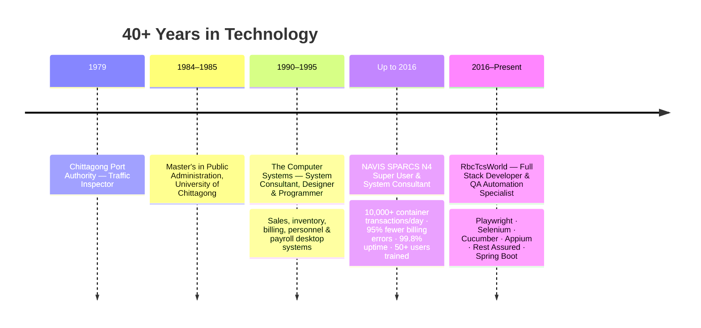

<!-- ============ STATUS BAR ============ -->

[-2dd4bf?style=for-the-badge&logo=apple&logoColor=white)](https://rbchy.github.io/rbchy/download.html)

---

## 📌 At a Glance

<table>
<tr>
<td width="50%" valign="top">

**🙋 Who I am**

QA Automation Engineer building **enterprise-grade BDD frameworks** with Playwright, Selenium, Cypress, Appium and Cucumber — backed by **four decades** of enterprise systems work, from container terminal management (NAVIS SPARCS N4) to modern web, mobile and API automation.

> *"Quality is never an accident; it is always the result of intelligent effort."*

</td>
<td width="50%" valign="top">

**📍 Quick facts**

| | |
|---|---|
| 📍 **Location** | West Norriton, PA 19403, USA |
| 📧 **Email** | chyranajit@gmail.com |
| 📞 **Phone** | +1 (267) 342-5565 |
| 💼 **Open to** | Full-time · Contract · Freelance |
| 🌐 **Mode** | Remote-first, flexible time zones |

</td>
</tr>
</table>

---

## 🧰 Tech Stack

**Languages** 

**Testing & Automation** 

**CI/CD, Cloud & Tools** 

---

## 📈 Skill Proficiency

| Area | Level | Experience |
|------|-------|-----------|
| ☕ **Java** | `████████████████████` Expert | 10+ yrs |
| 🐍 **Python** | `████████████████░░░░` Advanced | 5+ yrs |
| 🟦 **TypeScript** | `████████████████░░░░` Advanced | 4+ yrs |
| 🟨 **JavaScript** | `████████████░░░░░░░░` Intermediate | 3+ yrs |
| 🗄️ **SQL** | `████████████████░░░░` Advanced | 5+ yrs |
| 🎭 **Playwright** | `████████████████████` Expert | TS · Python · Java |
| 🌐 **Selenium WebDriver** | `████████████████████` Expert | Java · Python |
| 🥒 **Cucumber / BDD** | `████████████████████` Expert | JVM · JS · Behave |
| 📱 **Appium (Mobile)** | `████████████████░░░░` Advanced | Android · UiAutomator2 |
| 🌲 **Cypress** | `████████████░░░░░░░░` Intermediate | JS · TS |
| 🔌 **API (Postman / Rest Assured)** | `████████████████████` Expert | REST · OAuth 2.0 |
| ⚙️ **CI/CD (Jenkins / GH Actions)** | `████████████████░░░░` Advanced | Pipelines · PR gates |
| ☁️ **Cloud (Sauce Labs / AWS)** | `████████████████░░░░` Advanced | 700+ browser/OS combos |

<strong>🔎 Full technical skills matrix</strong>

### UI Automation & Testing Frameworks

| Framework | Language | Expertise | Use Case |
|-----------|----------|-----------|----------|
| Playwright | TypeScript, Python, Java | Expert | Modern, fast, reliable browser automation |
| Selenium WebDriver | Java, Python | Expert | Legacy and modern web applications |
| Cucumber | Java, Cucumber-JS | Expert | BDD feature files and test execution |
| Behave | Python | Advanced | Python-based BDD automation |
| TestNG | Java | Expert | Test execution, reporting, data-driven testing |
| JUnit | Java | Advanced | Unit and integration testing |
| Cypress | JavaScript, TypeScript | Intermediate | E2E testing for web applications |
| Appium | Java | Advanced | Android native app automation |

### API Testing & REST Automation

| Tool | Expertise | Use Cases |
|------|-----------|----------|
| Postman / Newman | Expert | Collections, environments, CI/CD integration |
| Rest Assured | Expert | REST API automation with Java + TestNG |
| Swagger / OpenAPI | Advanced | API specification and contract testing |
| Insomnia | Intermediate | REST API testing and debugging |
| GraphQL | Intermediate | GraphQL endpoint testing |

### Build, CI/CD & Cloud

| Tool | Proficiency | Notes |
|------|------------|-------|
| Maven | Expert | Dependency management, plugins, profiles |
| Gradle | Advanced | Build automation |
| npm | Advanced | Playwright / Cucumber-JS / Cypress projects |
| Jenkins | Expert | Pipelines, scheduling, parallel runs |
| GitHub Actions | Advanced | PR checks, scheduled test runs |
| Docker | Intermediate | Containerized test execution |
| Sauce Labs | Expert | Cross-browser cloud, video on failure |
| AWS (EC2 / S3 / CloudWatch) | Intermediate | Cloud test infrastructure |

### Reporting & Management

| Tool | Expertise |
|------|-----------|
| Allure Reports | Expert |
| ExtentReports | Advanced |
| Cucumber HTML / TestNG Reports | Advanced |
| Jira · Confluence · TestRail | Expert · Advanced · Advanced |

### Databases

| Database | Proficiency |
|----------|------------|
| MySQL | Expert |
| Oracle · PostgreSQL · DataFlex | Advanced |
| MongoDB · Firebase | Intermediate |

### Environments

| Category | Platforms |
|----------|-----------|
| **OS** | Windows (Expert) · macOS · Linux/Ubuntu (Advanced) |
| **IDEs** | IntelliJ IDEA · Eclipse · VS Code · NetBeans |
| **Browsers** | Chrome · Firefox · Safari · Edge · mobile browsers |
| **Version Control** | Git · GitHub · GitLab · Bitbucket |

---

## 🗺️ Skills Map

```mermaid
mindmap
  root((QA Automation))
    Web UI
      Playwright
        TypeScript
        Python
        Java
      Selenium WebDriver
      Cypress
    Mobile
      Appium 3
      UiAutomator2
      Sauce Labs devices
    API
      Rest Assured
      Postman / Newman
      OpenAPI
    BDD & Runners
      Cucumber JVM / JS
      Behave
      TestNG / JUnit 5
    DevOps
      Jenkins
      GitHub Actions
      Docker
      AWS
    Full Stack
      Java / Spring Boot
      MySQL / PostgreSQL
      Swing desktop apps
```

---

## 🏗️ How I Build Automation Frameworks

Every featured framework follows the same layered, maintainable architecture:

```mermaid
flowchart LR
    A["📝 Gherkin<br/>Feature Files"] --> B["🧩 Step<br/>Definitions"]
    B --> C["📄 Page Object<br/>Model"]
    C --> D{"🚀 Driver"}
    D --> D1["🎭 Playwright"]
    D --> D2["🌐 Selenium"]
    D --> D3["📱 Appium"]
    D --> D4["🔌 Rest Assured"]
    D1 & D2 & D3 & D4 --> E["🖥️ App Under Test<br/>(local · Sauce Labs · AWS)"]
    E --> F["📊 Allure / Extent /<br/>Cucumber Reports"]
    F --> G["⚙️ CI/CD<br/>Jenkins · GitHub Actions"]
    G -. "scheduled & PR runs" .-> A

    style A fill:#0d9488,color:#fff,stroke:#0d9488
    style C fill:#155e75,color:#fff,stroke:#155e75
    style D fill:#1e3a8a,color:#fff,stroke:#1e3a8a
    style F fill:#f59e0b,color:#000,stroke:#f59e0b
    style G fill:#22c55e,color:#000,stroke:#22c55e
```

---

## 🚦 Project Status Board

Live **last-commit** badges update automatically from GitHub; test results are from the latest recorded runs.

| Project | Stack | Test Results | Last Activity |
|---------|-------|-------------|---------------|
| 🔬 [QA Brains — Python + Playwright](https://github.com/rbchy/QaBrainsAutomationPythonPlawright) | Python · Playwright · Behave · Allure |    |  |
| 🔬 [QA Brains — TypeScript + Playwright](https://github.com/rbchy/QaBrainsAutomationTypeScriptPlaywright) | TS 5 · Playwright · Cucumber.js |    |  |
| 🔬 [QA Brains — Java + Playwright](https://github.com/rbchy/QaBrainsAutomationJavaPlaywright) | Java 17 · Playwright · Cucumber JVM · TestNG |  |  |
| 📱 [Appium Mobile Automation](https://github.com/rbchy/AppiumMobileAutomation) | Java · Appium · TestNG · Allure |  |  |
| 🏥 [OpenEMR Healthcare](https://github.com/rbchy/OpenEMR_Automation) | Java · Selenium · Cucumber · TestNG |  |  |
| ☁️ [Sauce Labs Cloud Automation](https://github.com/rbchy/QaBrainsSauceLabAPI_Automation) | Java · Selenium · Cucumber · Sauce Labs |  |  |
| 🔌 [API — Rest Assured](https://github.com/rbchy/QaBrainsAPIAutomationRestAssured) | Java · Rest Assured · TestNG |  |  |
| 🔌 [API — Postman / Newman](https://github.com/rbchy/QaBrainsAPIAutomation_Postman) | Postman · Newman |  |  |
| 🧪 [ClinTrial-Connect](https://github.com/rbchy/RbcTcsWorld_ClinTrial-Connect) | Spring Boot · Java |  |  |
| 💼 [Payroll Management System](https://github.com/rbchy/PayrollManagementSystem) | Java Swing · MySQL · JDBC |  |  |
| 🏭 [PPES Pharma Packaging](https://github.com/rbchy/PPES-Pharmaceutical-Packaging-Management) | Java 17 · MySQL 8 · DAO/MVC |  |  |

Legend:  under active development ·  complete & maintained ·  documented known bugs on the target site

---

## 📂 Featured Automation Projects

<strong>🔬 QA Brains Automation — Python · TypeScript · Java (Playwright)</strong>

 

| Variant | Stack | Highlights |
|---------|-------|-----------|
| [**Python**](https://github.com/rbchy/QaBrainsAutomationPythonPlawright) | Python 3.9+ · Playwright · Behave · Allure · POM | 12 passed · 3 skipped (known site bugs) · 0 failed · screenshot on failure · retry logic |
| [**TypeScript**](https://github.com/rbchy/QaBrainsAutomationTypeScriptPlaywright) | TS 5.x · Playwright (async/await) · Cucumber.js · Node.js | 14 passed · 1 pending (known site bug) · 0 failed · CI-ready with GitHub Actions |
| [**Java**](https://github.com/rbchy/QaBrainsAutomationJavaPlaywright) | Java 17+ · Playwright · Cucumber JVM · TestNG · Maven | Gherkin feature files · TestNG multi-threading · data-driven · TestNG + Allure reports |

<strong>🏥 OpenEMR Healthcare Automation — Selenium + Java + Cucumber</strong>

 

**Stack:** Java · Selenium WebDriver · Cucumber · TestNG · Maven · Jira
**Scope:** patient management, authentication, navigation, form validation, medical records access, role-based access control, appointment scheduling
**Live site:** [demo.openemr.io](https://demo.openemr.io) · **Repo:** [OpenEMR_Automation](https://github.com/rbchy/OpenEMR_Automation)

<strong>☁️ Sauce Labs Cloud Automation — Selenium + Java + Cucumber</strong>

 

**Stack:** Java · Selenium WebDriver · Cucumber · TestNG · Sauce Labs (700+ browser/OS combinations) · Maven · Jenkins
**Coverage:** Chrome, Firefox, Safari, Edge on Windows/macOS/Linux · desktop & mobile viewports · video on failure · Jenkins pipeline with 20+ parallel browser/OS combinations
**Repo:** [QaBrainsSauceLabAPI_Automation](https://github.com/rbchy/QaBrainsSauceLabAPI_Automation)

<strong>🔌 API Testing Framework — Postman + Rest Assured</strong>

 

**Stack:** Postman Collections · Newman · Rest Assured (Java) · TestNG · Maven · JSON/XML · OAuth 2.0
**Coverage:** positive/negative cases · auth flow validation · data-driven datasets · response-time and header checks · Dev/Staging/Prod environment config
**Repos:** [QaBrainsAPIAutomationRestAssured](https://github.com/rbchy/QaBrainsAPIAutomationRestAssured) · [QaBrainsAPIAutomation_Postman](https://github.com/rbchy/QaBrainsAPIAutomation_Postman)

<strong>💼 Payroll Management System — Java + MySQL + JDBC</strong>

 

**Stack:** Java (Swing/AWT) · MySQL 8.0+ · JDBC · DAO pattern · Maven
**Features:** employee CRUD · attendance tracking · automated salary calculation (HRA/DA/PF/Gross/Net) · pay slip generation · secure authentication
**Architecture:** UI → Service → DAO → Database
**Repo:** [PayrollManagementSystem](https://github.com/rbchy/PayrollManagementSystem)

<strong>🏭 Pharmaceutical Packaging Inventory Management — Java + MySQL</strong>

 

**Stack:** Java 17+ · MySQL 8.0+ · JDBC + MySQL Connector/J 9.7.0 · DAO + Service + MVC
**Modules:** material inventory CRUD · supplier management with performance ratings · real-time stock dashboard · transaction audit trail · purchase orders · low-stock alerts
**Repo:** [PPES-Pharmaceutical-Packaging-Management](https://github.com/rbchy/PPES-Pharmaceutical-Packaging-Management)

---

## 🥧 Portfolio Breakdown

```mermaid
pie showData
    title 32 Public Repositories by Category
    "Web UI Automation" : 16
    "Full-Stack Applications" : 7
    "Mobile (Appium)" : 5
    "API Automation" : 2
    "Portfolio / Profile" : 2
```

<strong>📦 Click to expand the full list of 32 repositories</strong>

| # | Repository | Category | Description |
|---|-----------|----------|-------------|
| 1 | [Amazon-Cypress-JavaScript-Automation](https://github.com/rbchy/Amazon-Cypress-JavaScript-Automation) | 🌐 Web | E2E framework for Amazon.com — Cypress 14 + Cucumber BDD |
| 2 | [AmazonSeleniumTest](https://github.com/rbchy/AmazonSeleniumTest) | 🌐 Web | Selenium test for Amazon |
| 3 | [AndroidUIAppiumTest_MyDemoEcommerce](https://github.com/rbchy/AndroidUIAppiumTest_MyDemoEcommerce) | 📱 Mobile | Appium 3, UiAutomator2, TestNG, Java 17 |
| 4 | [AppiumAutomation_ApiDemos](https://github.com/rbchy/AppiumAutomation_ApiDemos) | 📱 Mobile | Appium 3.5.2, TestNG, Maven, ExtentReports (POM) |
| 5 | [AppiumMobileAutomation](https://github.com/rbchy/AppiumMobileAutomation) | 📱 Mobile | Appium, TestNG & Allure — 100% pass rate on Sauce Labs My Demo App |
| 6 | [AppiumTest_Andriod_Automation](https://github.com/rbchy/AppiumTest_Andriod_Automation) | 📱 Mobile | Appium, TestNG, Cucumber BDD, POM |
| 7 | [BhojanAloy-Food-Coffee-Shop-POS-System](https://github.com/rbchy/BhojanAloy-Food-Coffee-Shop-POS-System) | 💻 App | Java Swing + MySQL point-of-sale with itemized bill preview |
| 8 | [Guru99TelTest](https://github.com/rbchy/Guru99TelTest) | 🌐 Web | Selenium/Java against the Guru99 demo site |
| 9 | [InventoryControlManagement_JavaMySql](https://github.com/rbchy/InventoryControlManagement_JavaMySql) | 💻 App | Real-time inventory — Java 17, MySQL 8.0, JDBC |
| 10 | [Multicart_Demo_Automation](https://github.com/rbchy/Multicart_Demo_Automation) | 🌐 Web | Multi-cart e-commerce — Java, Selenium, Cucumber |
| 11 | [NorthFace_AutomationExercise-BDD-Test-Automation](https://github.com/rbchy/NorthFace_AutomationExercise-BDD-Test-Automation) | 🌐 Web | UI, E2E, API, Unit, Accessibility, Performance & Security in one project |
| 12 | [OpenEMR_Automation](https://github.com/rbchy/OpenEMR_Automation) | 🌐 Web | Health records / medical practice management automation |
| 13 | [OrangeHRM_Automation](https://github.com/rbchy/OrangeHRM_Automation) | 🌐 Web | OrangeHRM HR platform automation |
| 14 | [OrangeHRM_TestAutomation_TestNG_Junit5](https://github.com/rbchy/OrangeHRM_TestAutomation_TestNG_Junit5) | 🌐 Web | AI-enhanced QA for HRM/Payroll with stubbed payroll/tax/insurance backend |
| 15 | [ParaBank-BankingAutomationJavaSelenium](https://github.com/rbchy/ParaBank-BankingAutomationJavaSelenium) | 🌐 Web | Banking automation — Java, Spring Boot, MySQL, Selenium |
| 16 | [PayrollManagementSystem](https://github.com/rbchy/PayrollManagementSystem) | 💻 App | Payroll management — Java & MySQL |
| 17 | [PayrollManagementSystems_Automation_Java_MySql_Selenium](https://github.com/rbchy/PayrollManagementSystems_Automation_Java_MySql_Selenium) | 💻 App | Java Swing + MySQL payroll desktop app, Maven-tested |
| 18 | [PPES-Pharmaceutical-Packaging-Management](https://github.com/rbchy/PPES-Pharmaceutical-Packaging-Management) | 💻 App | Pharmaceutical packaging management — Java, MySQL |
| 19 | [QaBrainsAPIAutomationRestAssured](https://github.com/rbchy/QaBrainsAPIAutomationRestAssured) | 🔌 API | QaBrains API automation — Rest Assured |
| 20 | [QaBrainsAPIAutomation_Postman](https://github.com/rbchy/QaBrainsAPIAutomation_Postman) | 🔌 API | QaBrains API automation — Postman & Newman |
| 21 | [QaBrainsAutomationCypressJavaScript](https://github.com/rbchy/QaBrainsAutomationCypressJavaScript) | 🌐 Web | E2E framework for the QaBrains e-commerce app — Cypress |
| 22 | [QaBrainsAutomationJavaPlaywright](https://github.com/rbchy/QaBrainsAutomationJavaPlaywright) | 🌐 Web | Java + Playwright |
| 23 | [QaBrainsAutomationJavaSelenium](https://github.com/rbchy/QaBrainsAutomationJavaSelenium) | 🌐 Web | Selenium + Java + Cucumber + TestNG + Maven |
| 24 | [QaBrainsAutomationPythonPlawright](https://github.com/rbchy/QaBrainsAutomationPythonPlawright) | 🌐 Web | Python + Playwright + Behave |
| 25 | [QaBrainsAutomationTypeScriptPlaywright](https://github.com/rbchy/QaBrainsAutomationTypeScriptPlaywright) | 🌐 Web | TypeScript + Playwright |
| 26 | [QaBrainsSauceLabAPI_Automation](https://github.com/rbchy/QaBrainsSauceLabAPI_Automation) | 🌐 Web | AI-driven quality platform — Java, Selenium, Cucumber on Sauce Labs |
| 27 | [ranajitchowdhury](https://github.com/rbchy/ranajitchowdhury) | 🗂️ Portfolio | 20+ projects across Mobile, E-Commerce, Banking, Healthcare, HR, API |
| 28 | [rbchy](https://github.com/rbchy/rbchy) | 🗂️ Portfolio | This profile README repository |
| 29 | [RbcTcsWorld-EPMS](https://github.com/rbchy/RbcTcsWorld-EPMS) | 💻 App | Full-stack payroll — Spring Boot REST API + test suite |
| 30 | [RbcTcsWorld_ClinTrial-Connect](https://github.com/rbchy/RbcTcsWorld_ClinTrial-Connect) | 💻 App | Spring Boot clinical-trial patient matching, 115+ automated tests |
| 31 | [Sauce-Demo.MyShopify.AutomationTest](https://github.com/rbchy/Sauce-Demo.MyShopify.AutomationTest) | 🌐 Web | E-commerce automation — Java + Selenium |
| 32 | [WebdriverIO-Native-DemoApp-MobileTestAutomationJavaAppiumTestNG](https://github.com/rbchy/WebdriverIO-Native-DemoApp-MobileTestAutomationJavaAppiumTestNG) | 📱 Mobile | WDIO Native Demo App — Appium 9.2.2, TestNG, Allure, ExtentReports |

---

## 🚀 Current Focus

| Focus Area | Progress |
|-----------|----------|
| Enterprise BDD frameworks from scratch |  |
| Playwright with TypeScript & Python |  |
| API automation & data-driven testing |  |
| CI/CD — Jenkins, GitHub Actions, cloud execution |  |
| Cloud testing — Sauce Labs, AWS |  |
| AI-assisted QA — test generation & analysis |  |
| Full-stack Java/Python with MySQL/PostgreSQL |  |

---

## 📊 Testing Methodologies & Practices

| Practice | Details | Tools |
|----------|---------|-------|
| **Agile Scrum** | Sprint planning, standups, retros, velocity | Jira, Confluence |
| **BDD** | Gherkin, Given/When/Then, living documentation | Cucumber, Behave |
| **SDLC / STLC** | Full lifecycle from requirements to production | Jira, TestNG, Maven |
| **Page Object Model** | Element abstraction, maintainable scripts | Selenium, Playwright |
| **CI/CD Integration** | Automated build/test, quality gates | Jenkins, GitHub Actions |
| **API Testing** | Contract, data-driven and auth testing | Postman, Rest Assured |
| **Defect Management** | Triage, severity, root cause analysis | Jira |
| **Cloud Testing** | Cross-browser/device, real-time dashboards | Sauce Labs, AWS |

---

## 👨‍💼 Career Journey

```mermaid
timeline
    title 40+ Years in Technology
    1979 : Chittagong Port Authority — Traffic Inspector
    1984–1985 : Master's in Public Administration, University of Chittagong
    1990–1995 : The Computer Systems — System Consultant, Designer & Programmer
              : Sales, inventory, billing, personnel & payroll desktop systems
    Up to 2016 : NAVIS SPARCS N4 Super User & System Consultant
               : 10,000+ container transactions/day · 95% fewer billing errors · 99.8% uptime · 50+ users trained
    2016–Present : RbcTcsWorld — Full Stack Developer & QA Automation Specialist
                 : Playwright · Selenium · Cucumber · Appium · Rest Assured · Spring Boot
```

<strong>📄 Detailed experience</strong>

**2016–Present — Self-Employed / RbcTcsWorld**
System Designer, Web Developer, Full Stack Developer & QA Automation Specialist. Enterprise BDD frameworks (Playwright, Selenium, Cucumber), API automation (Rest Assured, Postman), full-stack apps (Java, Python, JavaScript), inventory and payroll systems, healthcare application automation.

**1990–1995 — The Computer Systems (Bangladesh)**
System Consultant, Designer & Programmer. Custom desktop systems for sales management, inventory control, billing, personnel management, personnel banking, and payroll.

**1979–2016 — Chittagong Port Authority (Bangladesh)**
Traffic Inspector, Super User & System Consultant for the NAVIS SPARCS N4 Container Terminal Management System. Billing for 10,000+ container transactions/day, cut billing errors by 95%, trained 50+ users, maintained 99.8% uptime.

---

## 🎓 Education & Training

| Degree | Field | Institution | Year |
|--------|-------|-------------|------|
| Master's Degree | Public Administration | University of Chittagong, Bangladesh | 1984–1985 |
| Continuous Learning | QA Automation, BDD, Modern Web | Online Certifications & Self-Study | 2020–Present |

**Training:**

---

## 🌟 Why Hire Me?

| | |
|---|---|
| 🏛️ **Decades of systems experience** | Deep understanding of complex enterprise systems, process optimization and system design |
| 🤖 **Modern automation expertise** | Production-grade BDD frameworks with Playwright, Selenium, Cypress, Appium and Cucumber |
| 🧱 **Full-stack capabilities** | Backend services, APIs and databases for end-to-end solutions |
| ☁️ **Cloud-ready** | Sauce Labs cross-browser testing, AWS infrastructure, CI/CD pipelines |
| 🏠 **Remote-ready** | Disciplined, self-motivated, strong communicator |
| 📚 **Continuous learner** | TypeScript, modern Python patterns, AI-assisted QA |

---

## 💾 Desktop Portfolio App

[-2dd4bf?style=for-the-badge&logo=apple&logoColor=white)](https://rbchy.github.io/rbchy/download.html)

Desktop version of my portfolio, packaged with Electron — runs fully offline. The release page shows the `.dmg`, version notes and file size before downloading.

---

## 📈 GitHub Stats

<picture>
  <source media="(prefers-color-scheme: dark)" srcset="https://raw.githubusercontent.com/rbchy/rbchy/output/github-contribution-grid-snake-dark.svg" />
  <source media="(prefers-color-scheme: light)" srcset="https://raw.githubusercontent.com/rbchy/rbchy/output/github-contribution-grid-snake.svg" />
  
</picture>

---

## 📞 Let's Connect!

%20342--5565-0d9488?style=for-the-badge&logo=phone&logoColor=white)

*"Quality is never an accident; it is always the result of intelligent effort."*

